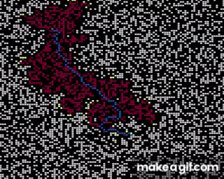

# A* pathfinding
Visualization for A* pathfinding

Type 'make' to compile the binary.

Execute binary ./pathfinding without options to generate a random grid.

Press P to pause, R to restart, SPACE to go step by step when paused.

Options: [--load/---save] + file. 

Change these variables in includes/pathfinding.h to:

  OBSTACLES - change the amount of obstacles in grid.

  START/END - change the starting and destination postion for the a* algorithm to find a path between.

  COL/ROWS  - change the amount of nodes in the grid.

  WIDTH/HEIGHT - size of window.
